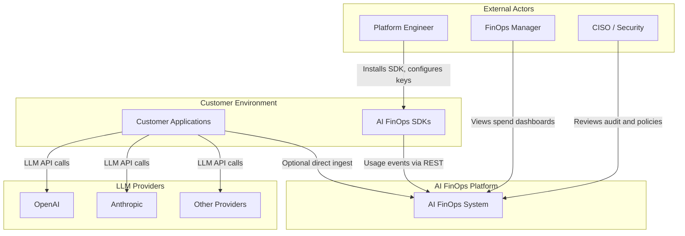

# C4 — Context Diagram

Shows external actors and systems that interact with AI FinOps.

## Responsibilities

| Actor | Goal |
|-------|------|
| Platform Engineer | Instrument apps with SDKs, route traffic through gateway |
| FinOps Manager | Track spend by team, model, and provider |
| CISO | Enforce governance, audit access, review policies |
| Customer Apps | Call LLM providers; emit usage telemetry |
| LLM Providers | Billable inference APIs (external to AI FinOps) |