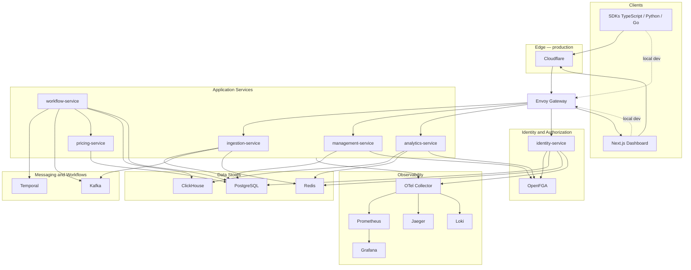

# C4 — Container Diagram

Deployable containers in the Phase 1 local stack. Production adds Cloudflare edge and EKS; see [10-infrastructure.md](../phase-0.5/10-infrastructure.md).

## Local ports (Docker Compose)

| Container | Port | Notes |
|-----------|------|-------|
| identity-service | 8080 | `/v1/auth` via Envoy |
| ingestion-service | 8081 | `/v1/events` via Envoy |
| management-service | 8082 | `/v1/orgs` via Envoy |
| analytics-service | 8083 | `/v1/orgs/*/spend` via Envoy |
| pricing-service | 8084 | gRPC only (internal) |
| workflow-service | 8085 | Temporal worker |
| web (dashboard) | 3000 | Next.js |
| Envoy HTTP | 8888 | API gateway |
| Envoy HTTPS API | 8443 | `api.ai-finops.local` |
| Envoy HTTPS App | 8444 | `app.ai-finops.local` |

## Communication summary

| From | To | Protocol | Phase |
|------|-----|----------|-------|
| SDK / Dashboard | Services | REST via Envoy | 1 (routing); 2 (handlers) |
| Envoy | identity-service | ext_authz gRPC | 2 |
| Ingestion | Kafka | Kafka | 2 |
| Workflow | Pricing | gRPC | 2 |
| All services | OTel Collector | OTLP | 1 |