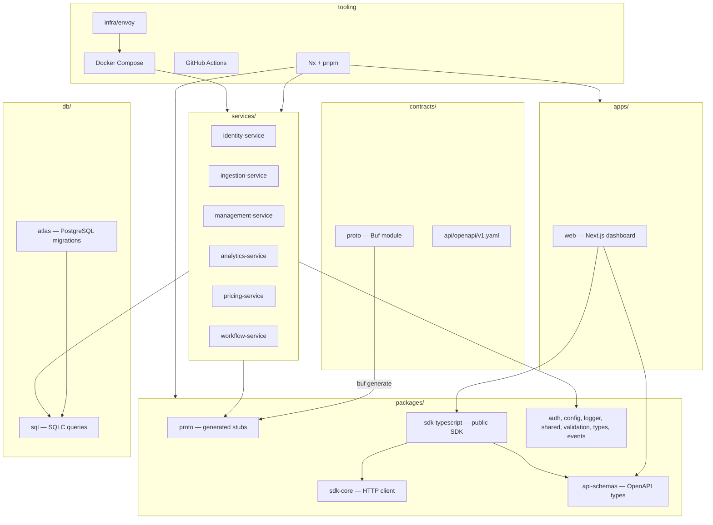
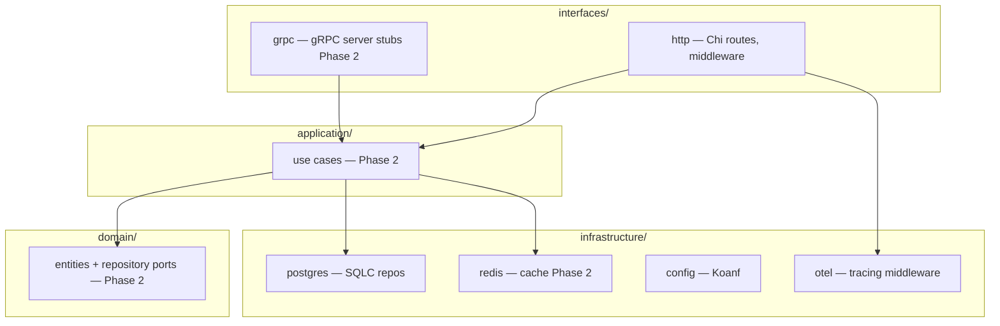

# C4 — Component Diagram

Phase 1 monorepo structure and the internal layout shared by every Go service shell.

## Monorepo components

## Go service internal components

Each service under `services/{name}/` follows the same hexagonal layout (Phase 1 shells wire health + readiness only):

## Nx orchestration

| Target | Projects | Purpose |
|--------|----------|---------|
| `build` | services, packages | Compile Go binaries and TS packages |
| `test` | services, packages, web | Unit and integration tests |
| `serve` | services, web | Local dev with hot reload |
| `proto-generate` | workspace | `buf lint` + `buf generate` |
| `sqlc-generate` | workspace | Regenerate SQLC from queries |
| `dev` | workspace | `scripts/dev.sh` — preflight + concurrent serve |