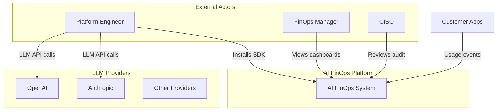
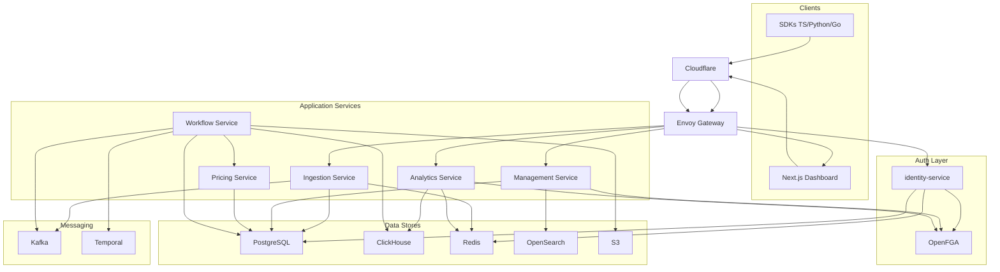

# 01 — System Architecture

## Overview

The AI FinOps platform is a cloud-native, event-driven system built for enterprise scale. Six Go microservices handle distinct bounded contexts, fronted by Envoy Gateway and Cloudflare, with dual data stores (PostgreSQL for business data, ClickHouse for telemetry).

---

## Locked Service Topology

```
Clients
│
├── SDKs (TypeScript, Python, Go)
└── Dashboard (Next.js)
        │
   Cloudflare
        │
   Envoy Gateway
        │
   identity-service ─── OpenFGA
        │
──────────────────────────────────────────
   Ingestion Service
   Management Service
   Analytics Service
   Pricing Service
   Workflow Service
──────────────────────────────────────────
        │
   Kafka          Temporal
        │
──────────────────────────────────────────
   PostgreSQL     ClickHouse     Redis
   OpenSearch     S3
──────────────────────────────────────────
   OpenTelemetry
   Prometheus → Grafana
   Jaeger
   Loki
```

---

## C4 Context Diagram



---

## C4 Container Diagram



---

## Service Catalog

| Service | Type | External REST | Internal gRPC | Primary data |
|---------|------|---------------|---------------|--------------|
| identity-service | Stateful | `/v1/auth/*` | `auth.v1.AuthService` | PostgreSQL, Redis |
| Ingestion Service | Write-heavy | `/v1/events*` | `ingestion.v1.IngestionService` | PostgreSQL (outbox), Kafka |
| Management Service | CRUD | `/v1/orgs/*` | `management.v1.ManagementService` | PostgreSQL, OpenSearch |
| Analytics Service | Read-heavy | `/v1/orgs/*/spend/*` | `analytics.v1.AnalyticsService` | ClickHouse, Redis |
| Pricing Service | Internal | — | `pricing.v1.PricingService` | PostgreSQL |
| Workflow Service | Async | — | `workflow.v1.WorkflowService` | Temporal, Kafka, ClickHouse |

Pricing and Workflow services have no public HTTP routes — cluster-internal gRPC only.

---

## Communication Patterns

| From | To | Protocol | Purpose |
|------|-----|----------|---------|
| SDK | Ingestion | REST via Envoy | Submit usage events |
| Dashboard | Management, Analytics, Auth | REST via Envoy | UI data and admin |
| Envoy | identity-service | ext_authz (gRPC/HTTP) | JWT validation for protected routes |
| Ingestion | Kafka | Kafka protocol | Publish usage events (via outbox relay) |
| Workflow | Pricing | gRPC | Cost calculation |
| Workflow | ClickHouse | Native TCP | Write usage_events |
| Management | OpenFGA | gRPC/HTTP | Authorization checks |
| Analytics | OpenFGA | gRPC/HTTP | Authorization checks |
| All services | OTel Collector | OTLP | Traces, metrics, logs |

**ADR-005:** REST external, gRPC internal. SDK and dashboard never call gRPC directly.

---

## Envoy Gateway Routing

| Host | Path prefix | Backend | Auth |
|------|-------------|---------|------|
| `api.ai-finops.local` | `/v1/events` | ingestion-service:8080 | API key (in-service) |
| `api.ai-finops.local` | `/v1/auth` | identity-service:8080 | Public (login/register) |
| `api.ai-finops.local` | `/v1/orgs/*/spend` | analytics-service:8080 | ext_authz JWT |
| `api.ai-finops.local` | `/v1/orgs` | management-service:8080 | ext_authz JWT |
| `app.ai-finops.local` | `/*` | web:3000 | Session cookie |

Gateway API resources: `GatewayClass` → `Gateway` → `HTTPRoute` → `BackendTrafficPolicy`.

---

## Architectural Principles

1. **Security by design** — Auth Service + OpenFGA at the boundary; tenant scoping on every query
2. **API-first** — OpenAPI (external) and Buf protos (internal) defined before implementation
3. **Event-driven** — Kafka decouples ingest from processing; outbox ensures durability
4. **Multi-tenant** — `org_id` on every row and every ClickHouse partition key
5. **SDK-first** — Customer integration via thin SDKs; backend complexity hidden
6. **Observability built in** — OTel instrumentation mandatory per service from day one
7. **Everything as code** — Atlas migrations, Buf protos, Terraform, Helm

### Patterns in use

- Clean / Hexagonal Architecture per Go service
- Repository pattern (SQLC-generated queries)
- Transactional Outbox (ingest → Kafka)
- Circuit breaker on gRPC clients (Workflow → Pricing)
- Idempotency keys (Redis NX + PostgreSQL durable store)
- Retry with exponential backoff (Temporal activities)

---

## Deployment Stages

| Stage | Infrastructure |
|-------|---------------|
| Development | Docker Compose (all services + infra) |
| MVP | Single VPS, Docker |
| Beta | Managed RDS + Docker services |
| Production | EKS + Helm + Envoy Gateway + Cloudflare |
| Enterprise | Multi-region EKS |

See [10-infrastructure.md](./10-infrastructure.md) for Terraform module map.

---

## Phase 1 Service Scope

| Service | Phase 1 delivers |
|---------|-----------------|
| identity-service | Email/password, JWT, API key validation |
| Ingestion | Single + batch events, outbox, Kafka publish |
| Management | Org/team/user/key CRUD, audit logs |
| Analytics | Summary, timeseries, by-provider, by-team |
| Pricing | OpenAI + Anthropic catalog, cost calculation |
| Workflow | ProcessUsageEvent, nightly RecomputeRollups |

Deferred to later phases: SAML, MFA, OpenSearch audit index, S3 archive, notification service.