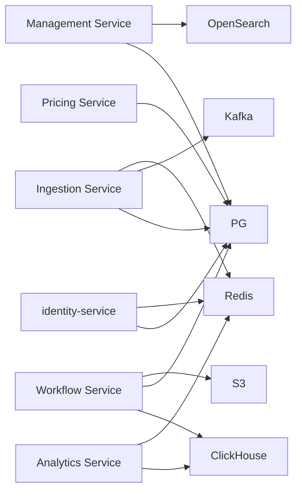
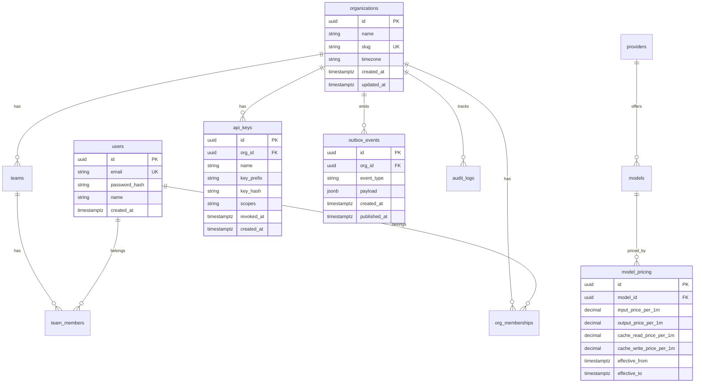

# 02 — Data Model

## Data Store Strategy

| Store | Purpose | Owner services |
|-------|---------|----------------|
| **PostgreSQL 16** | Business data, ACID transactions | Auth, Management, Pricing, Ingestion (outbox) |
| **ClickHouse** | Usage telemetry, analytics rollups | Workflow (write), Analytics (read) |
| **Redis** | Cache, rate limits, idempotency fast-path | Auth, Ingestion, Analytics |
| **OpenSearch** | Searchable audit logs (Phase 2) | Management |
| **S3** | Cold archive, exports (Phase 2) | Workflow |
| **Kafka** | Event stream | Ingestion (produce), Workflow (consume) |

**ADR-001:** Event-first dual-store. PostgreSQL never stores high-volume usage events.

---

## Per-Service Data Ownership



**Rule:** Only Workflow Service writes to ClickHouse. Only Ingestion Service writes to `outbox_events`.

---

## PostgreSQL Schema (Atlas-managed)

Declarative source: `db/atlas/schemas/postgres.sql`  
Migrations: `db/atlas/migrations/` via `atlas migrate diff` and `atlas migrate apply`

### Entity Relationship



### Core tables

| Table | Service | Notes |
|-------|---------|-------|
| `organizations` | Management | Tenant root |
| `users` | Auth | Global user accounts |
| `org_memberships` | Management | user ↔ org with role |
| `teams` | Management | Soft-delete via `deleted_at` |
| `team_members` | Management | user ↔ team |
| `api_keys` | Management | Argon2id hash; prefix for display |
| `refresh_tokens` | Auth | Rotating refresh tokens |
| `providers` | Pricing | openai, anthropic, etc. |
| `models` | Pricing | gpt-4o, claude-3-5-sonnet, etc. |
| `model_pricing` | Pricing | Versioned with effective dates |
| `idempotency_keys` | Workflow | `(org_id, key)` unique; 7-day TTL |
| `outbox_events` | Ingestion | Transactional outbox |
| `audit_logs` | Management | Append-only |

### Indexes

| Table | Index |
|-------|-------|
| `api_keys` | `(key_prefix)` WHERE `revoked_at IS NULL` |
| `org_memberships` | `(user_id, org_id)` |
| `teams` | `(org_id)` WHERE `deleted_at IS NULL` |
| `model_pricing` | `(model_id, effective_from DESC)` |
| `idempotency_keys` | `UNIQUE (org_id, idempotency_key)` |
| `outbox_events` | `(published_at)` WHERE `published_at IS NULL` |
| `audit_logs` | `(org_id, created_at DESC)` |

### SQLC query ownership

| Service | SQLC package | Example queries |
|---------|-------------|-----------------|
| Auth | `internal/infrastructure/postgres/auth/` | `GetUserByEmail`, `CreateRefreshToken` |
| Management | `.../management/` | `CreateTeam`, `ListApiKeys`, `InsertAuditLog` |
| Pricing | `.../pricing/` | `GetPriceAtTime`, `UpsertModelPricing` |
| Ingestion | `.../ingestion/` | `InsertOutboxEvent` |
| Workflow | `.../workflow/` | `CheckIdempotency`, `RecordIdempotency` |

---

## ClickHouse Schema

Migrations: `db/clickhouse/migrations/` (versioned SQL, applied via deploy script)

### usage_events

```sql
CREATE TABLE usage_events (
    id UUID,
    org_id UUID,
    idempotency_key String,
    team_id Nullable(UUID),
    user_id Nullable(UUID),
    provider LowCardinality(String),
    model LowCardinality(String),
    input_tokens UInt32,
    output_tokens UInt32,
    cache_read_tokens UInt32 DEFAULT 0,
    cache_write_tokens UInt32 DEFAULT 0,
    cost_usd Decimal64(8),
    is_priced UInt8,
    project String DEFAULT '',
    feature String DEFAULT '',
    customer String DEFAULT '',
    metadata String,
    occurred_at DateTime64(3, 'UTC'),
    received_at DateTime64(3, 'UTC')
) ENGINE = MergeTree()
PARTITION BY (org_id, toYYYYMM(occurred_at))
ORDER BY (org_id, occurred_at, id)
TTL occurred_at + INTERVAL 90 DAY;
```

### daily_spend_rollups (materialized view)

```sql
CREATE MATERIALIZED VIEW daily_spend_rollups_mv
TO daily_spend_rollups AS
SELECT
    org_id,
    toDate(occurred_at) AS rollup_date,
    team_id,
    provider,
    model,
    sum(input_tokens) AS total_input_tokens,
    sum(output_tokens) AS total_output_tokens,
    sum(cost_usd) AS total_cost_usd,
    count() AS event_count
FROM usage_events
GROUP BY org_id, rollup_date, team_id, provider, model;

CREATE TABLE daily_spend_rollups (
    org_id UUID,
    rollup_date Date,
    team_id Nullable(UUID),
    provider LowCardinality(String),
    model LowCardinality(String),
    total_input_tokens UInt64,
    total_output_tokens UInt64,
    total_cost_usd Decimal64(8),
    event_count UInt32
) ENGINE = SummingMergeTree()
PARTITION BY (org_id, toYYYYMM(rollup_date))
ORDER BY (org_id, rollup_date, team_id, provider, model);
```

Analytics Service queries **only** `daily_spend_rollups` for dashboard charts (NFR-PERF-005/006).

---

## Redis Key Schema

| Key pattern | Service | TTL | Purpose |
|-------------|---------|-----|---------|
| `apikey:{prefix}` | Ingestion | 5m | Cached API key → org_id lookup |
| `ratelimit:{key_id}:{minute}` | Ingestion | 2m | 1000 events/min counter |
| `idempotency:{org_id}:{key}` | Workflow | 24h | Fast-path dedupe |
| `session:{user_id}` | Auth | 15m | Active session metadata |
| `spend:summary:{org_id}:{hash}` | Analytics | 60s | Dashboard query cache |

---

## Atlas Workflow

```bash
# Edit declarative schema
vim db/atlas/schemas/postgres.sql

# Generate migration
atlas migrate diff --env local add_teams_table

# Apply locally
atlas migrate apply --env local

# Regenerate SQLC
sqlc generate

# CI: lint migrations
atlas migrate lint --env local
atlas schema inspect --env local  # drift detection
```

See [ADR-007](../adr/007-atlas-migrations.md).