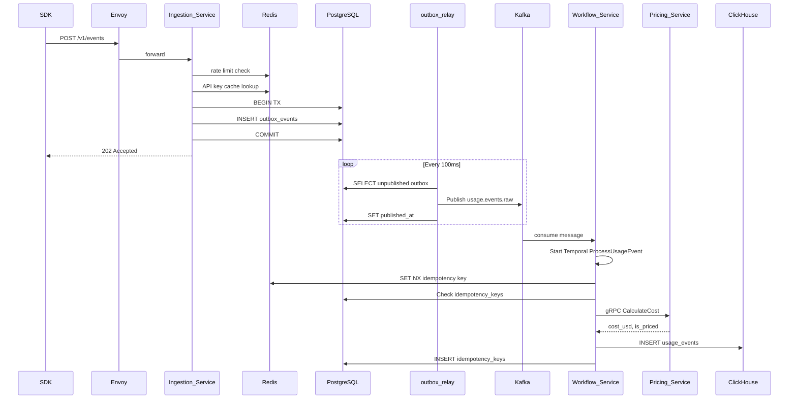

# 04 — Ingestion Pipeline

## Overview

Usage events flow asynchronously from SDK through Ingestion Service, Kafka, and Workflow Service to ClickHouse. The transactional outbox pattern guarantees no event is lost between API acknowledgment and Kafka publish.

---

## End-to-End Flow



---

## Ingestion Service Responsibilities

1. Validate request schema (`go-playground/validator`)
2. Authenticate API key (Redis cache → PostgreSQL fallback)
3. Enforce rate limit: 1,000 events/min per API key
4. Write `outbox_events` row in PostgreSQL transaction
5. Return `202 Accepted` with `{ event_id, status: "queued" }`
6. Never call Pricing or ClickHouse synchronously

**Target latency:** p99 < 100ms (NFR-PERF-001)

---

## Transactional Outbox

| Field | Value |
|-------|-------|
| Table | `outbox_events` |
| Writer | Ingestion Service only |
| Reader | `outbox-relay` sidecar (same deployment or separate) |
| Poll interval | 100ms |
| Batch size | 500 rows |

Outbox relay is idempotent: Kafka producer uses `event_id` as message key; consumers dedupe.

---

## Kafka Topics

| Topic | Partitions | Key | Retention | Producer | Consumer |
|-------|-----------|-----|-----------|----------|----------|
| `usage.events.raw` | 32 | `org_id` | 7 days | outbox-relay | Workflow Service |
| `usage.events.dlq` | 4 | `org_id` | 30 days | Workflow Service | ops (manual) |

### Message schema (Protobuf)

Uses `ingestion.v1.UsageEventCreated` — see `api/proto/ingestion/v1/event.proto`.

---

## Temporal Workflows

### ProcessUsageEvent

| Step | Activity | Timeout | Retries |
|------|----------|---------|---------|
| 1 | `CheckIdempotency` | 5s | 3 |
| 2 | `CalculateCost` (gRPC → Pricing Service) | 10s | 5 |
| 3 | `InsertUsageEvent` (ClickHouse) | 15s | 3 |
| 4 | `RecordIdempotency` (PostgreSQL) | 5s | 3 |

On exhaustion: send to `usage.events.dlq`; alert via Alertmanager.

### RecomputeRollups (nightly cron)

Rebuilds ClickHouse materialized view data for trailing 7 days. Safety net for late-arriving events.

### SyncPricingCatalog (weekly cron)

Fetches OpenAI and Anthropic pricing via provider plugins; upserts `model_pricing` in PostgreSQL.

---

## Cost Calculation (Pricing Service)

```
cost_usd = (input_tokens × input_price_per_1m / 1_000_000)
         + (output_tokens × output_price_per_1m / 1_000_000)
         + (cache_read_tokens × cache_read_price_per_1m / 1_000_000)
         + (cache_write_tokens × cache_write_price_per_1m / 1_000_000)
```

Price lookup: `model_pricing` WHERE `model_id` AND `effective_from <= occurred_at` ORDER BY `effective_from DESC` LIMIT 1.

Unknown model: `is_priced = false`, `cost_usd = 0`, emit metric `unpriced_events_total`.

---

## Failure Modes

| Failure | Behavior |
|---------|----------|
| Ingestion Service down | SDK retries with exponential backoff; events buffered client-side (SDK, max 1000) |
| Kafka unavailable | Outbox accumulates; relay catches up when Kafka recovers |
| Workflow/Pricing down | Kafka lag grows; no data loss; Alertmanager fires on lag > 5min |
| ClickHouse down | Temporal retries; DLQ after max attempts |
| Duplicate event | Idempotency key skipped silently; return existing event_id |

---

## Batch Ingest

`POST /v1/events/batch` — max 500 events per request.

Response:
```json
{
  "accepted": 498,
  "rejected": 2,
  "errors": [
    { "index": 12, "code": "VALIDATION_ERROR", "message": "model is required" }
  ]
}
```

Per-event validation failures do not reject the entire batch.