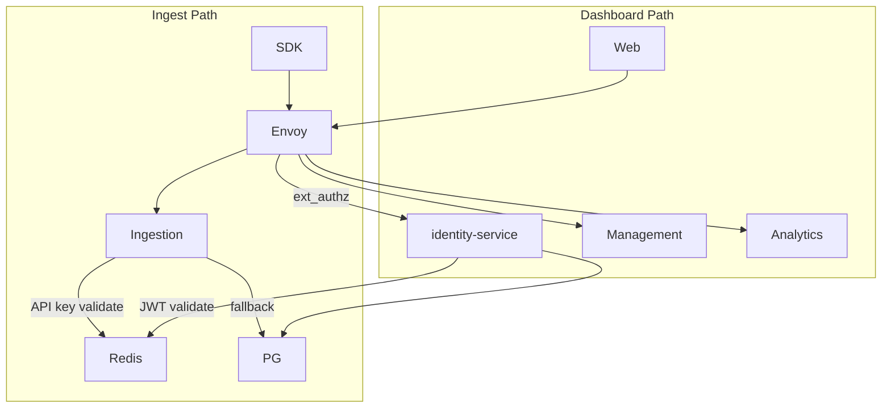

# 05 — Security and Tenancy

## Security Principles

1. Security by design — not bolted on after launch
2. Least privilege — OpenFGA enforces minimal access per request
3. Defense in depth — Cloudflare WAF + Envoy + service-level auth + data-layer tenant scoping
4. No PII in telemetry — prompt content never stored (Phase 1)
5. Immutable audit trail — append-only `audit_logs`

---

## Authentication Architecture



### Ingest authentication

- `Authorization: Bearer aif_<32_random_chars>`
- Key hashed with **Argon2id** in PostgreSQL
- Prefix lookup via Redis cache (5min TTL)
- Validated in Ingestion Service (not ext_authz — throughput optimization)

### Dashboard authentication

- Email/password registration (Phase 1)
- JWT access token: RS256, 15-minute expiry
- Refresh token: opaque, 7-day expiry, stored hashed in PostgreSQL
- Envoy **ext_authz** calls identity-service `ValidateToken` gRPC before forwarding to Management/Analytics
- Future (Phase 4): OIDC, SAML, MFA, Passkeys

---

## Authorization (OpenFGA)

### Type definitions

```
type user
type organization
type team
type spend_report
type api_key

relations:
  define organization: [user] as admin
  define organization: [user] as member
  define team: [user] as manager
  define team: [user] as member
  define spend_report: [user] as viewer from admin
  define spend_report: [user] as viewer from member
  define api_key: [user] as manager from admin
```

### Example tuples

```
user:anne admin organization:acme
user:anne member organization:acme
user:bob member team:engineering
user:bob viewer spend_report:acme
```

### Check patterns

| Action | Check |
|--------|-------|
| View org spend | `user:{id} viewer spend_report:{org_id}` |
| Create API key | `user:{id} manager api_key:{org_id}` |
| Invite user | `user:{id} admin organization:{org_id}` |
| View team spend (Phase 2 ABAC) | team-scoped contextual tuple |

Management and Analytics services call OpenFGA before every mutation and query.

---

## Tenant Isolation

| Layer | Enforcement |
|-------|-------------|
| API | `org_id` extracted from JWT or API key; passed as required parameter |
| OpenFGA | Relationship tuples scoped to org |
| PostgreSQL | Every query includes `WHERE org_id = $1` (SQLC enforces via query design) |
| ClickHouse | Every query includes `WHERE org_id = {org_id}` ; partition key includes org_id |
| Kafka | Message key = `org_id` |

**ADR-003:** Shared database, row-level isolation. Integration tests must verify cross-tenant access returns 403/empty.

---

## Encryption

| Data state | Method |
|------------|--------|
| In transit | TLS 1.3 (Cloudflare → Envoy → services) |
| At rest (PostgreSQL) | AWS RDS encryption (AES-256) |
| At rest (ClickHouse) | Provider-managed encryption |
| At rest (S3) | SSE-KMS |
| Passwords | Argon2id (memory=64MB, iterations=3, parallelism=4) |
| API keys | Argon2id hash; plaintext shown once at creation |
| Secrets | AWS Secrets Manager via Koanf provider |

---

## Threat Model (STRIDE)

| Threat | Mitigation |
|--------|------------|
| **Spoofing** | API key + JWT; Argon2id hashing |
| **Tampering** | Immutable usage_events in ClickHouse; append-only audit_logs |
| **Repudiation** | audit_logs with actor_id, IP, timestamp |
| **Information disclosure** | Tenant isolation; no prompt content; RBAC via OpenFGA |
| **Denial of service** | Rate limiting (1000 events/min/key); Cloudflare DDoS; HPA |
| **Elevation of privilege** | OpenFGA checks on every request; admin role explicit |

---

## OWASP Top 10 Controls

| Risk | Control |
|------|---------|
| Broken access control | OpenFGA + org_id scoping |
| Cryptographic failures | TLS 1.3, Argon2id, KMS |
| Injection | Parameterized SQL (SQLC); input validation |
| Insecure design | Threat model; security ADRs |
| Security misconfiguration | Terraform + Helm; Trivy scans |
| Vulnerable components | Dependabot, Renovate, Trivy |
| Auth failures | Auth Service + MFA (Phase 4) |
| Data integrity failures | Outbox pattern; idempotency |
| Logging failures | Structured slog + Loki + audit_logs |
| SSRF | No user-controlled URLs in Phase 1 |

---

## Configuration (Koanf)

Per-service config load order:
1. `defaults.yaml`
2. `config.{env}.yaml`
3. Environment variables (`AI_FINOPS_*`)
4. AWS Secrets Manager (production)

Secrets never in git. `.env` files gitignored for local dev only.