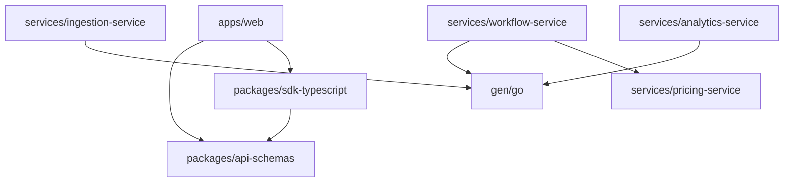

# 07 — Monorepo Structure

## Tooling

| Tool | Purpose |
|------|---------|
| **Nx** | Task orchestration, dependency graph, affected commands |
| **pnpm** | Package manager, workspaces |
| **Make** | Developer shortcuts (`make dev`, `make test`) |

**ADR-002:** Nx + pnpm polyglot monorepo.

---

## Repository Layout

```
ai-finops/
├── apps/
│   └── web/                              # @ai-finops/web — Next.js dashboard
├── services/
│   ├── identity-service/                 # Go — Chi, Wire, SQLC
│   ├── ingestion-service/
│   ├── management-service/
│   ├── analytics-service/
│   ├── pricing-service/                  # gRPC only
│   └── workflow-service/                 # Temporal worker
├── packages/
│   ├── sdk-typescript/                   # @ai-finops/sdk
│   ├── sdk-python/                       # ai-finops (Phase 2)
│   ├── sdk-go/                           # go module for Go SDK
│   └── api-schemas/                      # Generated OpenAPI types (TS)
├── api/
│   ├── openapi/v1.yaml
│   └── proto/                            # Buf module
├── db/
│   ├── atlas/                            # PostgreSQL migrations
│   └── clickhouse/migrations/
├── gen/go/                               # buf generate output (gitignored)
├── infra/
│   ├── terraform/
│   ├── docker/
│   └── helm/
├── nx.json
├── pnpm-workspace.yaml
├── Makefile
└── README.md
```

---

## Go Service Internal Layout

Each service under `services/{name}/`:

```
identity-service/
├── cmd/server/main.go
├── internal/
│   ├── domain/              # Entities, value objects, repo interfaces
│   ├── application/         # Use cases
│   ├── infrastructure/
│   │   ├── postgres/        # SQLC-generated + repo impl
│   │   ├── redis/
│   │   ├── grpc/            # gRPC clients
│   │   └── config/          # Koanf loader
│   └── interfaces/
│       ├── http/            # Chi routes (if external)
│       └── grpc/            # gRPC server (if applicable)
├── sql/
│   ├── queries/             # SQLC input
│   └── schema/              # symlink or copy from db/atlas
├── config/
│   ├── defaults.yaml
│   └── config.local.yaml
├── wire.go
├── wire_gen.go
├── Dockerfile
├── project.json             # Nx project config
└── go.mod
```

---

## Nx Project Graph



### Key Nx targets

| Target | Projects | Command |
|--------|----------|---------|
| `build` | all | Compile Go binaries / Next.js build |
| `test` | all | go test / vitest |
| `lint` | all | golangci-lint / eslint |
| `proto:generate` | root | `buf generate` |
| `db:migrate` | root | `atlas migrate apply` |
| `sqlc:generate` | services/* | `sqlc generate` per service |

---

## Makefile Shortcuts

```makefile
dev:          docker compose --profile services up
dev-full:     docker compose --profile full up
proto:        cd api/proto && buf generate
migrate:      atlas migrate apply --env local
sqlc:         nx run-many -t sqlc-generate
test:         nx run-many -t test
lint:         nx run-many -t lint
```

---

## Dependency Rules

1. `packages/*` must not import from `services/*`
2. `services/*` may import from `gen/go` and shared Go modules only
3. `apps/web` imports from `packages/api-schemas` and `packages/sdk-typescript`
4. No service imports another service's `internal/` package — communicate via gRPC only
5. Proto definitions are the contract — implementers generate stubs, not hand-write

---

## CI Affected Commands

```bash
nx affected -t test --base=main
nx affected -t lint --base=main
nx affected -t build --base=main
```

Only changed services and their dependents run in PR checks.