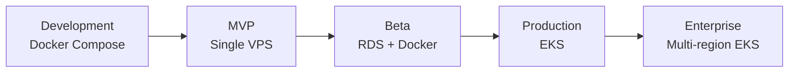

# 10 — Infrastructure

## Deployment Path



| Stage | Compute | Data | Edge |
|-------|---------|------|------|
| Development | Docker Compose | Local containers | localhost |
| MVP | Single VPS (Hetzner/DO) | Docker PostgreSQL | Cloudflare |
| Beta | Docker on ECS/VM | RDS PostgreSQL, managed Redis | Cloudflare |
| Production | EKS | RDS, ClickHouse Cloud, MSK, ElastiCache | Cloudflare + Envoy Gateway |
| Enterprise | Multi-region EKS | Cross-region RDS read replicas, CH replication | Cloudflare global |

---

## AWS Services (Production)

| Service | AWS resource | Purpose |
|---------|-------------|---------|
| Compute | EKS | Go services, Temporal worker, Next.js |
| Relational DB | RDS PostgreSQL 16 | Business data (Multi-AZ) |
| Analytics DB | ClickHouse Cloud | Usage telemetry |
| Cache | ElastiCache Redis 7 | Sessions, rate limits, query cache |
| Streaming | MSK (Kafka) | Usage event stream |
| Object storage | S3 | Cold archive, exports |
| Secrets | Secrets Manager + KMS | API secrets, JWT keys |
| DNS | Route53 | api.*, app.* |
| TLS | ACM | Certificates for Envoy Gateway |
| IAM | IAM roles | Service accounts (IRSA) |

---

## Envoy Gateway

Replaces NGINX Ingress. Uses Kubernetes Gateway API.

### Resources

```yaml
# Simplified — full spec in infra/helm/envoy-gateway/
apiVersion: gateway.networking.k8s.io/v1
kind: Gateway
metadata:
  name: ai-finops-gateway
spec:
  gatewayClassName: envoy-gateway
  listeners:
    - name: https-api
      hostname: api.ai-finops.io
      port: 443
      protocol: HTTPS
    - name: https-app
      hostname: app.ai-finops.io
      port: 443
      protocol: HTTPS
```

### HTTPRoute map

| Hostname | Path | Backend service | Port |
|----------|------|----------------|------|
| `api.*` | `/v1/events` | ingestion-service | 8080 |
| `api.*` | `/v1/auth` | identity-service | 8080 |
| `api.*` | `/v1/orgs/*/spend` | analytics-service | 8080 |
| `api.*` | `/v1/orgs` | management-service | 8080 |
| `app.*` | `/*` | web | 3000 |

### ext_authz

Envoy calls `identity-service:9090` (gRPC ext_authz) for all routes except `/v1/events` and `/v1/auth/login|register`.

---

## Terraform Module Layout

```
infra/terraform/
├── README.md
├── environments/
│   ├── dev/
│   ├── staging/
│   └── production/
└── modules/
    ├── network/          # VPC, subnets, security groups
    ├── eks/              # EKS cluster, node groups, IRSA
    ├── rds/              # PostgreSQL 16 Multi-AZ
    ├── elasticache/      # Redis 7
    ├── msk/              # Kafka
    ├── s3/               # Buckets + lifecycle policies
    ├── kms/              # Encryption keys
    ├── route53/          # DNS zones and records
    └── observability/    # Prometheus, Grafana (or AMP managed)
```

Each environment composes modules:

```hcl
module "eks" {
  source = "../../modules/eks"
  cluster_name = "ai-finops-prod"
  node_instance_types = ["m6i.large"]
}
```

State: S3 backend + DynamoDB lock per environment.

---

## Helm Charts

| Chart | Contents |
|-------|----------|
| `helm/identity-service` | Deployment, Service, HPA, ServiceAccount |
| `helm/ingestion-service` | + outbox-relay sidecar |
| `helm/management-service` | — |
| `helm/analytics-service` | — |
| `helm/pricing-service` | ClusterIP only (internal) |
| `helm/workflow-service` | Deployment + Temporal worker config |
| `helm/web` | Next.js deployment |
| `helm/envoy-gateway` | Gateway API CRDs + Envoy Gateway |

All charts: liveness/readiness probes, resource limits, OTel env vars, IRSA annotations.

---

## Cloudflare

| Feature | Purpose |
|---------|---------|
| DNS | api.* and app.* CNAME to load balancer |
| Proxy | DDoS protection, CDN for static assets |
| WAF | OWASP ruleset, rate limiting at edge |
| SSL | Full (strict) mode to origin |

---

## Multi-Region (Enterprise)

- Primary region: us-east-1
- Secondary: eu-west-1 (data residency)
- PostgreSQL: cross-region read replica (async)
- ClickHouse: replicated cluster per region; org-level data residency flag
- Kafka: cluster per region; no cross-region replication (events are regional)
- Route53 latency-based routing