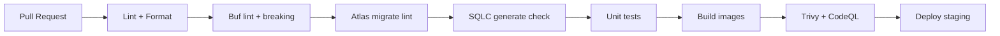

# 11 — CI/CD and Quality

## CI Platform

**GitHub Actions** — all workflows in `.github/workflows/`

---

## Pipeline Stages



---

## Workflows

### `ci.yml` (every PR)

| Job | Command | Fail on |
|-----|---------|---------|
| lint-go | `golangci-lint run ./...` | any issue |
| lint-ts | `eslint .` + `prettier --check` | any issue |
| buf-lint | `cd api/proto && buf lint` | lint errors |
| buf-breaking | `buf breaking --against '.git#branch=main'` | breaking changes |
| atlas-lint | `atlas migrate lint --env local` | migration issues |
| sqlc-check | `sqlc generate && git diff --exit-code` | drift |
| test-go | `go test ./... -race -cover` | failures or < 80% on pricing/auth |
| test-web | `vitest run` | failures |
| build | `nx run-many -t build` | compile errors |

### `security.yml` (weekly + PR)

| Job | Tool |
|-----|------|
| codeql | GitHub CodeQL (Go, TypeScript) |
| trivy | Container image CVE scan |
| dependency-review | GitHub dependency review |
| zap | OWASP ZAP baseline scan (staging) |

### `release.yml` (tag `v*`)

1. Build and push Docker images to ECR
2. Sign containers (cosign)
3. Generate SBOM (Syft)
4. Deploy to production via Helm
5. Run smoke tests (k6)

---

## Testing Strategy

| Layer | Tool | Scope |
|-------|------|-------|
| Go unit | `testing` + Testify | Domain logic, cost calculation, auth |
| Go integration | Testcontainers | PostgreSQL, Redis, Kafka |
| TypeScript unit | Vitest | React components, API client |
| E2E | Playwright | Login → dashboard → view spend |
| Load | k6 | Ingest 1000 events/sec sustained |
| Security | OWASP ZAP | Staging environment baseline |

### Critical test cases (Phase 1)

- Cost calculation matches OpenAI/Anthropic published prices
- Idempotency: duplicate event returns same result, no double cost
- Tenant isolation: org A cannot read org B spend (403)
- API key: revoked key rejected; valid key accepted
- Outbox: event persisted even if Kafka temporarily down

---

## Code Quality Standards

| Standard | Tool |
|----------|------|
| Conventional Commits | commitlint |
| Semantic Versioning | manual tag + release workflow |
| Pre-commit hooks | Husky |
| Go linting | golangci-lint |
| TS linting | ESLint |
| Formatting | Prettier (TS), gofumpt (Go) |
| Editor consistency | EditorConfig |

---

## Dependency Management

| Ecosystem | Tool |
|-----------|------|
| Go modules | Dependabot + Renovate |
| npm/pnpm | Dependabot + Renovate |
| Docker base images | Renovate |
| Protobuf deps | `buf dep update` |

---

## Container Build

Each Go service Dockerfile:

```dockerfile
# Multi-stage
FROM golang:1.25-alpine AS builder
WORKDIR /app
COPY . .
RUN CGO_ENABLED=0 go build -o /server ./cmd/server

FROM gcr.io/distroless/static-debian12
COPY --from=builder /server /server
ENTRYPOINT ["/server"]
```

Images tagged: `{service}:{git-sha}` and `{service}:latest` on main.