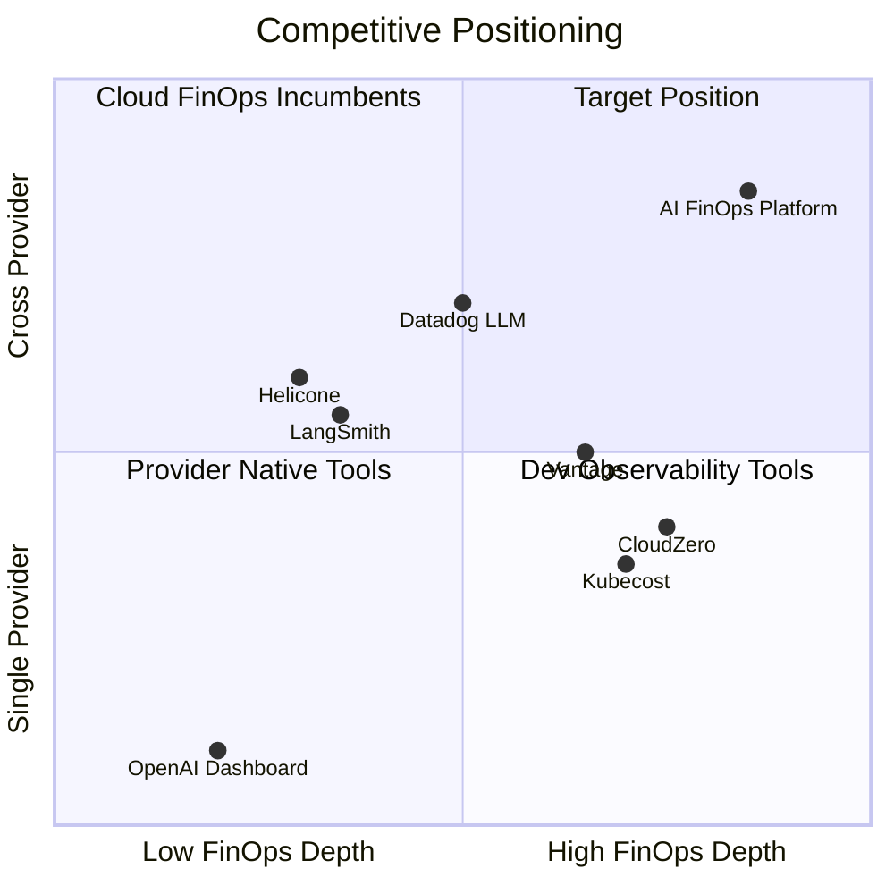

# 03 — Competitor Analysis

## Competitive Landscape Overview

The AI cost management space is fragmented across four categories. No single player owns cross-provider AI FinOps today.

---

## Category 1: Provider-Native Cost Dashboards

### OpenAI Usage Dashboard
- **Strengths:** Accurate, real-time, zero integration for OpenAI-only shops
- **Weaknesses:** OpenAI only; no team attribution; no governance; no cross-provider view
- **Pricing:** Free (included with API access)
- **Threat level:** Low — only competitive for single-provider companies

### Azure OpenAI / AWS Bedrock / Vertex AI Billing
- **Strengths:** Enterprise trust, integrates with cloud billing
- **Weaknesses:** Cloud-provider silo; no cross-cloud AI view; weak attribution
- **Pricing:** Free (part of cloud console)
- **Threat level:** Low-Medium — enterprise buyers may accept "good enough"

### Anthropic Console
- **Strengths:** Clean usage view for Anthropic API
- **Weaknesses:** Single provider; no FinOps workflows
- **Threat level:** Low

**Our gap exploitation:** These tools cannot unify spend across providers. A company using OpenAI + Anthropic + Bedrock needs three consoles and a spreadsheet.

---

## Category 2: Developer Observability (LLM Tracing)

### Helicone
- **Strengths:** Easy proxy integration, request logging, cost tracking, open source option
- **Weaknesses:** Developer-centric (not FinOps); weak team/budget workflows; limited governance
- **Pricing:** Free tier + $20–$200/mo paid plans
- **Threat level:** Medium — closest feature overlap for ingestion

### LangSmith (LangChain)
- **Strengths:** Deep LangChain integration, trace debugging, evaluation
- **Weaknesses:** LangChain-ecosystem dependent; not a FinOps product; no budgets/governance
- **Pricing:** Free tier + usage-based
- **Threat level:** Low-Medium — different buyer persona

### Langfuse
- **Strengths:** Open source, self-hostable, tracing + cost
- **Weaknesses:** Engineering tool, not enterprise FinOps; limited multi-tenancy
- **Threat level:** Low

### Portkey / LiteLLM
- **Strengths:** Multi-provider gateway, cost tracking, routing
- **Weaknesses:** Proxy architecture (not FinOps platform); governance is secondary
- **Threat level:** Medium — could add FinOps features

**Our gap exploitation:** These tools trace requests for debugging. Finance teams do not use them. They lack budgets, chargeback, forecasting, audit trails, and executive dashboards.

---

## Category 3: Cloud FinOps Incumbents

### CloudZero
- **Strengths:** Mature FinOps platform, unit economics, team attribution for cloud
- **Weaknesses:** AI/LLM is a bolt-on feature, not core; limited provider depth
- **Pricing:** $50K–$200K+/year enterprise
- **Threat level:** Medium-High — could build AI module if market proves out

### Kubecost
- **Strengths:** Kubernetes-native cost allocation, open source roots
- **Weaknesses:** Infrastructure-focused; LLM cost is not native
- **Threat level:** Low-Medium

### Vantage / Finout
- **Strengths:** Multi-cloud cost management, growing enterprise base
- **Weaknesses:** AI cost management is emerging, not differentiated
- **Threat level:** Medium

**Our gap exploitation:** Cloud FinOps tools understand infrastructure costs, not token economics. LLM pricing models (per-token, cache discounts, batch pricing, model tiers) require domain-specific expertise.

---

## Category 4: Enterprise Observability

### Datadog LLM Observability
- **Strengths:** Enterprise distribution, existing customer base, integrated with infra monitoring
- **Weaknesses:** Expensive; observability-first not FinOps-first; limited governance
- **Pricing:** Enterprise add-on ($$$)
- **Threat level:** High — if they prioritize AI FinOps depth

### New Relic AI Monitoring
- **Strengths:** APM heritage, enterprise sales motion
- **Weaknesses:** Early stage for LLM; not FinOps-focused
- **Threat level:** Medium

**Our gap exploitation:** Datadog customers pay for infrastructure monitoring. AI FinOps is a separate purchase decision with a different buyer (FinOps, not SRE). We can be 10x cheaper and 10x more focused.

---

## Emerging Direct Competitors

| Company | Focus | Stage | Notes |
|---------|-------|-------|-------|
| **FinOps AI startups** (various) | AI cost tracking | Seed–Series A | Fragmented, no clear winner yet |
| **Cloudflare AI Gateway** | Proxy + cost tracking | GA | Proxy model, not full FinOps platform |
| **Databricks AI spend** | Databricks-specific | GA | Only for Databricks customers |

---

## Competitive Comparison Matrix

| Capability | Provider Dashboards | Dev Observability | Cloud FinOps | **AI FinOps Platform** |
|------------|--------------------|--------------------|--------------|------------------------|
| Cross-provider view | No | Partial | Partial | **Yes** |
| Real-time cost tracking | Yes (one) | Yes | No | **Yes** |
| Team/project attribution | No | Basic | Yes (cloud) | **Yes (AI-native)** |
| Budgets and alerts | No | No | Yes (cloud) | **Yes** |
| Model governance | No | No | No | **Yes** |
| Waste detection | No | No | No | **Yes** |
| ROI analytics | No | No | No | **Yes** |
| Executive dashboards | No | No | Yes | **Yes** |
| SSO / SCIM | N/A | No | Yes | **Yes (Phase 4)** |
| Prompt optimization | No | Partial | No | **Yes (Phase 3)** |
| Finance workflows | No | No | Yes | **Yes** |
| SDK integration | N/A | Yes | No | **Yes** |
| Audit trail | No | No | Partial | **Yes** |

---

## Competitive Strategy

### Where we win
1. **Cross-provider AI-native FinOps** — not cloud FinOps with AI bolted on
2. **Finance + Engineering dual persona** — dashboards for FinOps, SDK for engineers
3. **Governance depth** — model policies, compliance, audit (not just cost charts)
4. **Speed to value** — SDK install → dashboard in 24 hours

### Where we avoid competing (initially)
1. Request-level tracing and debugging (LangSmith territory)
2. LLM gateway / routing (Portkey/LiteLLM territory)
3. General cloud cost management (CloudZero territory)
4. Infrastructure monitoring (Datadog territory)

### Defensibility moat (long-term)
1. Normalized pricing catalog across all providers (continuous maintenance burden)
2. Historical spend data and trend analysis (switching cost)
3. Governance policy engine tied to spend data
4. Optimization recommendations trained on cross-customer patterns (anonymized)

---

## Competitive Intelligence Actions (Pre-Launch)

- [ ] Sign up for Helicone, Langfuse, Portkey free tiers — document onboarding experience
- [ ] Review Datadog LLM Observability pricing and feature set
- [ ] Monitor CloudZero and Vantage product announcements for AI features
- [ ] Track Y Combinator and Techstars batches for AI FinOps startups
- [ ] Interview 5 target customers: "What tools do you use for AI cost today?"