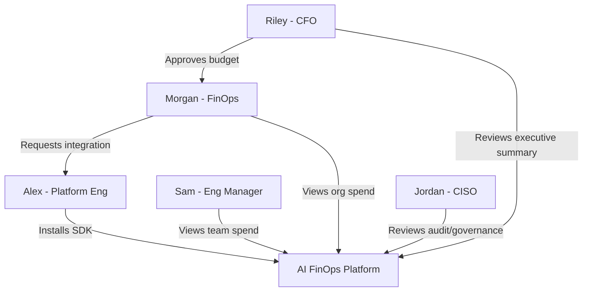

# 07 — User Personas

## Persona Overview

Five personas interact with the platform. Each has distinct goals, pain points, and interaction patterns. The product must serve all five — but the primary buyer and daily user differ by company stage.

| Persona | Role | Buyer? | Daily user? | Phase 0 priority |
|---------|------|--------|-------------|------------------|
| Alex | Platform Engineer | No | During integration | P0 — integrator |
| Morgan | FinOps Manager | Yes | Daily | P0 — primary buyer |
| Sam | Engineering Manager | No | Weekly | P1 — team lead |
| Jordan | CISO | Influencer | Monthly | P1 — enterprise gate |
| Riley | CFO | Executive sponsor | Quarterly | P2 — board reports |

---

## Alex — Platform Engineer

### Profile
- **Title:** Senior Platform Engineer / Staff Engineer
- **Age:** 28–38
- **Reports to:** VP Engineering
- **Team size:** 3–8 platform engineers
- **Tools daily:** Terraform, Kubernetes, Datadog, GitHub Actions, internal SDKs

### Goals
- Integrate AI cost tracking without disrupting existing application code
- Provide engineering teams with a standard way to attribute AI usage
- Minimize maintenance burden of cost tracking infrastructure

### Pain Points
- No standard SDK for AI cost tracking across providers
- Each team logs AI usage differently (or not at all)
- Building in-house cost tracking is a distraction from core platform work
- Provider pricing changes require manual spreadsheet updates

### Jobs to Be Done
1. "Install something in 30 minutes that gives FinOps their dashboard"
2. "Make it easy for product teams to tag their AI calls with team/project metadata"
3. "Don't break production if the cost tracking service goes down"

### Platform Interactions
| Action | Frequency |
|--------|-----------|
| Install and configure SDK | Once |
| Create API keys | Once per environment |
| Add metadata tags to LLM calls | During integration |
| Check integration health | Weekly (first month), then rarely |
| Review docs for new providers | As needed |

### What Makes Alex Recommend Us
- SDK works on first try with clear docs
- Non-blocking async ingestion (never slows down LLM calls)
- Supports their stack (Node.js, Python at minimum)
- OpenAPI spec for custom integrations

### What Makes Alex Reject Us
- SDK requires refactoring existing LLM call patterns
- Integration takes more than 1 day
- Poor documentation or missing examples
- Ingestion failures cause application errors

---

## Morgan — FinOps Manager

### Profile
- **Title:** FinOps Manager / Cloud Cost Analyst / FP&A Analyst
- **Age:** 30–45
- **Reports to:** CFO or VP Finance
- **Team size:** 1–5 FinOps analysts
- **Tools daily:** Excel, CloudZero/Vantage, AWS Cost Explorer, Looker/Tableau

### Goals
- Allocate AI costs to teams and projects accurately
- Forecast AI spend for quarterly budgeting
- Identify waste and present savings opportunities to leadership
- Produce board-ready AI spend reports

### Pain Points
- Downloads CSVs from 3 provider dashboards and merges manually
- Cannot attribute costs below org-level
- Discovers overages 30+ days after they occur
- No historical trend data for AI spend forecasting
- Board asks "What is our AI ROI?" and has no answer

### Jobs to Be Done
1. "Show me AI spend by team for last month — in one click"
2. "Alert me when any team exceeds their budget"
3. "Generate a board slide showing AI spend trend and ROI"

### Platform Interactions
| Action | Frequency |
|--------|-----------|
| View spend dashboard | Daily |
| Filter by team/provider/time | Daily |
| Export reports | Weekly |
| Configure team budgets | Monthly |
| Review waste recommendations | Weekly |
| Present to leadership | Monthly/quarterly |

### What Makes Morgan Buy
- Dashboard shows data within 24 hours of integration
- Numbers match provider invoices (trust)
- Can filter and export without engineering help
- Budget alerts prevent surprise overages

### What Makes Morgan Churn
- Data does not match provider bills (trust destroyed)
- Dashboard requires engineering to set up filters
- Missing providers they use
- Cannot export data for board presentations

---

## Sam — Engineering Manager

### Profile
- **Title:** Engineering Manager / Team Lead
- **Age:** 32–42
- **Reports to:** Director of Engineering
- **Team size:** 5–15 engineers
- **Tools daily:** Jira, GitHub, Slack, team dashboards

### Goals
- Keep team AI spend within allocated budget
- Understand which features/projects drive the most AI cost
- Justify AI tool requests to leadership with data

### Pain Points
- No visibility into team's AI consumption until finance flags an issue
- Cannot see which engineer or feature is driving costs
- Budget conversations with finance are reactive, not proactive

### Jobs to Be Done
1. "How much did my team spend on AI this month?"
2. "Which project is our most expensive AI consumer?"
3. "Prove to finance that our AI spend is justified"

### Platform Interactions
| Action | Frequency |
|--------|-----------|
| View team spend dashboard | Weekly |
| Check budget status | Weekly |
| Drill into project/feature costs | Monthly |
| Respond to budget alerts | As triggered |

---

## Jordan — CISO

### Profile
- **Title:** CISO / Head of Security / Security Engineering Lead
- **Age:** 35–50
- **Reports to:** CEO or CTO
- **Team size:** 5–30 security engineers
- **Tools daily:** SIEM, CSPM, vulnerability scanners, GRC platforms

### Goals
- Know which AI models are being used across the organization
- Enforce approved model policies
- Detect sensitive data being sent to external AI providers
- Produce audit evidence for compliance reviews

### Pain Points
- No inventory of AI model usage across the company
- Employees use personal ChatGPT accounts with company data
- Cannot enforce "no GPT-4 for customer data" policies
- Auditors ask about AI governance and get blank stares

### Jobs to Be Done
1. "Show me every AI model call in the last 90 days"
2. "Block usage of unapproved models"
3. "Generate an audit report for SOC 2 / ISO 27001 review"

### Platform Interactions
| Action | Frequency |
|--------|-----------|
| Review model usage audit log | Monthly |
| Configure governance policies | Quarterly |
| Review compliance reports | Quarterly |
| Investigate policy violations | As triggered |

### What Makes Jordan Approve the Purchase
- Immutable audit trail of all AI usage
- Model allowlist/blocklist enforcement
- Sensitive data detection (Phase 2+)
- SSO integration with existing identity provider

---

## Riley — CFO

### Profile
- **Title:** CFO / VP Finance
- **Age:** 40–55
- **Reports to:** CEO / Board
- **Tools daily:** ERP, FP&A software, board reporting tools

### Goals
- Understand AI as a line item on the P&L
- Forecast AI spend for annual budgeting
- Report AI ROI to the board
- Ensure AI spend scales efficiently with revenue

### Pain Points
- AI spend is a growing cost with zero visibility
- Cannot forecast AI costs for next quarter
- Board asks about AI ROI with no data to answer
- AI spend may be buried across multiple vendor line items

### Jobs to Be Done
1. "What did we spend on AI last quarter?"
2. "What will we spend next quarter?"
3. "Is our AI investment generating returns?"

### Platform Interactions
| Action | Frequency |
|--------|-----------|
| Review executive summary dashboard | Monthly |
| Review board report (exported by Morgan) | Quarterly |
| Approve AI budget allocations | Annually |

---

## Persona Interaction Map

