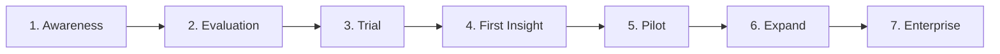

# 08 — Customer Journey

## Journey Overview

The customer journey follows a bottom-up adoption pattern: engineering integrates, FinOps discovers value, leadership expands. This mirrors how Datadog, Sentry, and PagerDuty achieved enterprise adoption.

---

## Stage 1: Awareness

### Trigger Events
- Finance flags a 200%+ YoY increase in AI vendor invoices
- CTO receives board question: "What is our AI ROI?"
- Platform engineer searches "AI cost tracking" or "LLM spend monitoring"
- Peer company mentions they use an AI FinOps tool at a conference
- Cloud cost tool (CloudZero/Vantage) adds basic AI module — customer realizes they need more depth

### Customer State
- Knows AI spend is growing but has no unified view
- May be manually merging provider CSVs
- Has not yet allocated budget for an AI FinOps tool

### Our Actions
- Content marketing: "The State of AI Spend" report, blog posts on AI FinOps
- SEO: target "AI cost management," "LLM spend tracking," "AI FinOps"
- Conference presence: FinOps X, KubeCon, AI engineering meetups
- Outbound to companies with public AI features and growing engineering teams

### Success Criteria
- Prospect visits website and reads pricing page
- Prospect signs up for trial or books demo

---

## Stage 2: Evaluation

### Duration: 1–2 weeks

### Customer Actions
- Reviews website, pricing, documentation
- Compares against Helicone, provider dashboards, DIY options
- Checks if their tech stack is supported (Node.js, Python SDK)
- Asks: "Will this work with our OpenAI + Anthropic setup?"

### Our Actions
- Self-serve documentation available (no sales call required for trial)
- 15-minute demo video showing dashboard with sample data
- Comparison page: "AI FinOps Platform vs. Helicone vs. spreadsheets"
- Free 14-day trial with Growth-tier features

### Key Decision Factors
| Factor | Weight |
|--------|--------|
| Cross-provider support | High |
| Integration effort (< 1 day) | High |
| Price vs. AI spend magnitude | Medium |
| FinOps dashboard quality | High |
| Security/compliance features | Medium (higher for enterprise) |

### Drop-off Risks
- "We only use one provider" → not our customer
- "We'll build it in-house" → show build vs. buy calculator
- "Too expensive for our spend level" → Starter tier or defer

---

## Stage 3: Trial

### Duration: 14 days

### Customer Actions
1. Signs up, creates organization
2. Platform engineer installs SDK (npm install @ai-finops/sdk)
3. Adds 3–5 lines of code around existing LLM calls
4. Deploys to staging, then production
5. Waits for events to flow

### Our Actions
- Onboarding email sequence (Day 0, 1, 3, 7, 12)
- In-app setup wizard with integration checklist
- Day 1 check: "Are events flowing?" automated alert to our CS
- Day 3: if no events, trigger outreach to help with integration
- Day 7: highlight dashboard features they haven't used
- Day 12: trial expiration reminder with conversion CTA

### Integration Timeline
| Milestone | Target time |
|-----------|-------------|
| Account created | Day 0 |
| SDK installed | Day 0–1 |
| First event ingested | Day 0–1 |
| 100+ events flowing | Day 1–2 |
| Dashboard viewed by FinOps | Day 1–3 |
| Trial decision | Day 12–14 |

### Drop-off Risks
- SDK integration fails → immediate support outreach
- No events after 48 hours → debug call offered
- Only engineer sees it, FinOps never logs in → prompt FinOps invite

---

## Stage 4: First Insight (Aha Moment)

### The Aha Moment
> FinOps manager opens the dashboard and sees, for the first time, AI spend broken down by team and provider — data they have never had before.

### What Triggers It
- Dashboard shows > $1,000 in attributed spend across 2+ teams
- A team they didn't know was using AI shows up with significant spend
- Provider breakdown reveals one provider is 80% of spend (expected 50%)
- A single expensive model (GPT-4) accounts for 60% of costs

### Our Actions
- In-app tooltip: "You just unlocked cross-provider AI visibility"
- Email to FinOps persona: "Here's what your first week of data shows"
- Highlight top insight: "Your highest-spend team is X at $Y/month"

### Conversion Signal
When FinOps shares the dashboard link with their manager or finance colleague, conversion probability exceeds 60%.

---

## Stage 5: Pilot

### Duration: 2–4 weeks (first paid month)

### Customer Actions
- Converts to paid (Starter or Growth)
- Expands SDK integration to more services/teams
- Sets up first team budgets
- Shares dashboard with engineering managers
- Begins using data in weekly team meetings

### Our Actions
- Customer success check-in at Day 7 of paid subscription
- Help configure team budgets and alerts
- Provide "Monthly AI Spend Report" template
- Identify expansion opportunities (more teams, more providers)

### Success Criteria
- 3+ weekly dashboard users
- 2+ teams with attributed spend
- 1+ budget configured
- Customer mentions us in internal Slack/email positively

---

## Stage 6: Expand

### Duration: 1–6 months

### Customer Actions
- Rolls out SDK to all engineering teams
- Adds additional providers (Azure OpenAI, Bedrock, etc.)
- Configures budgets for all teams
- CISO reviews governance features
- Finance includes AI FinOps data in quarterly board report

### Our Actions
- Quarterly business review with Growth/Enterprise customers
- Proactive feature recommendations based on usage patterns
- Upsell to higher tier as usage grows
- Case study request (if NPS > 8)

### Expansion Triggers
| Signal | Upsell |
|--------|--------|
| Event volume exceeds tier | Overage or tier upgrade |
| Requests SSO | Enterprise tier |
| Adds 3+ providers | Enterprise tier |
| CISO asks about governance | Governance module |
| Multiple departments want access | Multi-org Enterprise |

---

## Stage 7: Enterprise

### Duration: Ongoing

### Customer Actions
- SSO/SAML integration with Okta/Azure AD
- SCIM provisioning for automatic user management
- Governance policies enforced org-wide
- AI spend data integrated into ERP/FP&A tools
- Platform becomes system of record for AI financial reporting

### Our Actions
- Dedicated customer success manager
- Quarterly executive business reviews
- Early access to new features
- Co-marketing / case study
- SLA monitoring and proactive incident communication

---

## Journey Metrics by Stage

| Stage | Conversion rate target | Avg duration |
|-------|----------------------|--------------|
| Awareness → Evaluation | 10% of website visitors | 1–2 weeks |
| Evaluation → Trial | 30% of evaluators | 1 day |
| Trial → First Insight | 80% of trials | 1–3 days |
| First Insight → Pilot (paid) | 40% of trials | 14 days |
| Pilot → Expand | 70% of paid (month 2) | 1–3 months |
| Expand → Enterprise | 20% of Growth customers | 6–12 months |

---

## Anti-Journey (Churn Path)

| Stage | Churn trigger | Prevention |
|-------|--------------|------------|
| Trial | Integration too hard | Proactive integration support |
| Trial | Data doesn't match invoices | Pricing accuracy validation |
| Pilot | Only 1 user (engineer), FinOps never engaged | Require FinOps invite in onboarding |
| Expand | Customer builds in-house replacement | Continuous feature velocity |
| Enterprise | Acquisition / budget cuts | Executive relationship, ROI documentation |