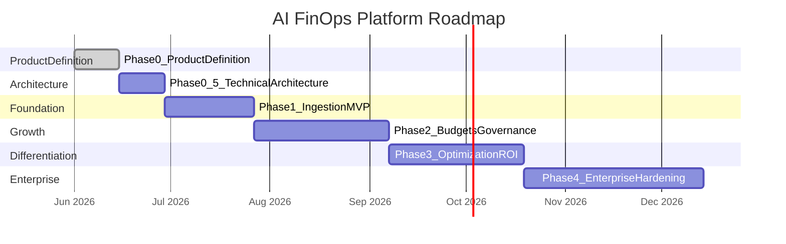

# 12 — Future Roadmap

## Roadmap Philosophy

Ship the smallest thing that proves the data loop works, then expand based on customer evidence — not feature wishlists. Each phase has explicit entry criteria (what must be true before starting) and exit criteria (what must be true before moving on).

---

## Phase Overview

---

## Phase 0: Product Definition

**Duration:** 2 weeks  
**Status:** Complete

### Deliverables
- 12 product definition documents (this doc set)
- Customer discovery interview guide
- Validated problem statement and ICP

### Exit Criteria
- [ ] 5 customer discovery interviews completed
- [ ] 3+ prospects confirm pain and willingness to pay
- [ ] Founding team aligned on ICP, pricing, and Phase 1 scope
- [ ] Go/no-go decision: proceed to Phase 0.5

---

## Phase 0.5: Technical Architecture

**Duration:** 2 weeks  
**Status:** Complete

### Deliverables
- 12 technical architecture documents (`docs/phase-0.5/`)
- 8 Architecture Decision Records (`docs/adr/`)
- OpenAPI 3.1 spec (`api/openapi/v1.yaml`)
- Buf proto module (`api/proto/`) — 6 gRPC services
- PostgreSQL declarative schema (`db/atlas/`)
- Docker Compose specification
- Locked stack: Go, Next.js, PostgreSQL + ClickHouse, Kafka, Temporal, OpenFGA, Envoy Gateway

### Exit Criteria
- [ ] Architecture reviewed by senior engineer
- [ ] Data model supports all Phase 1 Must requirements
- [ ] Security design passes threat model review
- [ ] Team aligned on tech stack and repo structure

---

## Phase 1: Ingestion MVP

**Duration:** 4 weeks  
**Entry:** Phase 0.5 exit criteria met

### Scope
- Turborepo monorepo (apps/web, apps/api, packages/sdk, packages/shared, packages/db, workers/cost-processor)
- Multi-tenant org/team/user model
- API key authentication
- Usage event ingestion API (single + batch)
- Redis queue + cost calculation worker
- OpenAI + Anthropic pricing catalog
- Node.js SDK v0.1
- Spend dashboard (summary, by provider, by team, time series)
- API key management UI
- Audit log
- Docker Compose local dev

### Exit Criteria
- [ ] 3 design partners integrated and viewing dashboards
- [ ] Time to first insight < 24 hours (measured)
- [ ] Cost accuracy > 99% vs. provider invoices
- [ ] 1 paying customer
- [ ] Ingest p99 < 100ms, dashboard load < 2s

### Key Metrics
- 3 design partners
- 1 paying customer
- $1M/month AI spend tracked on platform

---

## Phase 2: Budgets and Governance

**Duration:** 6 weeks  
**Entry:** Phase 1 exit criteria met + 5+ paying customers

### Scope
- Team monthly budgets with soft limits
- Email and in-app budget alerts
- Spend forecasting (linear projection)
- Model-level and user-level spend breakdown
- 4 additional providers (Gemini, Grok, DeepSeek, Mistral)
- Python SDK
- CSV export
- Governance: approved model allowlist, policy violation alerts
- Provider billing API import (supplement to SDK)
- Scheduled email reports

### Exit Criteria
- [ ] 10+ paying customers
- [ ] Budget alerts deployed by > 50% of customers
- [ ] Waste detection identifying savings opportunities
- [ ] $25K MRR
- [ ] 4+ providers supported

### Key Metrics
- 10 paying customers
- $25K MRR
- $10M/month AI spend tracked

---

## Phase 3: Optimization and ROI

**Duration:** 6 weeks  
**Entry:** Phase 2 exit criteria met

### Scope
- Expensive model detection and downgrade recommendations
- Duplicate prompt detection
- Cache opportunity identification
- Model routing suggestions
- ROI estimation (time saved vs. cost)
- Executive summary PDF reports
- Cost per customer attribution (for SaaS companies)
- Project/feature spend breakdown
- Reverse proxy / API gateway ingestion mode
- Hard budget limits (block events when exceeded)

### Exit Criteria
- [ ] 30+ paying customers
- [ ] Optimization recommendations acted on by > 30% of customers
- [ ] $50K MRR
- [ ] 1 enterprise customer (>$5K/mo)
- [ ] Documented customer case study with measurable savings

### Key Metrics
- 30 paying customers
- $50K MRR
- $100M/month AI spend tracked

---

## Phase 4: Enterprise Hardening

**Duration:** 8 weeks  
**Entry:** Phase 3 exit criteria met + enterprise pipeline exists

### Scope
- SSO via SAML/OIDC (Okta, Azure AD, Google Workspace)
- SCIM user provisioning
- Multi-org parent/child hierarchy
- White-label branding
- All remaining providers (Azure OpenAI, Bedrock, Vertex AI, Ollama)
- Custom provider plugin SDK
- Billing and subscription management (Stripe)
- SOC 2 Type II audit initiation
- GDPR right to erasure
- Data residency (EU region)
- 99.9% uptime SLA
- Dedicated customer success for Enterprise

### Exit Criteria
- [ ] 3+ enterprise customers (>$5K/mo each)
- [ ] SSO deployed and used by enterprise customers
- [ ] SOC 2 Type II audit in progress
- [ ] $100K MRR
- [ ] All 11+ providers supported

### Key Metrics
- 3 enterprise customers
- $100K MRR
- $1B/month AI spend tracked

---

## Beyond Phase 4 (Vision)

| Capability | Timeline | Description |
|------------|----------|-------------|
| AI productivity scoring | Phase 5 | Score prompt quality and estimate time saved |
| Prompt library and reuse | Phase 5 | Org-wide prompt templates with cost tracking |
| Chargeback automation | Phase 5 | Auto-allocate AI costs to internal P&L codes |
| ERP integration | Phase 5 | Export to NetSuite, SAP, QuickBooks |
| AI agent cost tracking | Phase 6 | Multi-step agent workflows with cumulative cost |
| Multi-region deployment | Phase 6 | EU, US, APAC data residency |
| Marketplace | Phase 6 | Third-party optimization and governance plugins |
| AI spend benchmarks | Phase 6 | Anonymized cross-customer benchmarking |
| Mobile app | Future | Executive spend alerts on mobile |

---

## Decision Gates

At each phase transition, the team must answer:

| Question | Go criteria |
|----------|-------------|
| Do customers want this? | Qualitative: interview evidence. Quantitative: usage/adoption metrics. |
| Can we build this in the allocated time? | Engineering estimate validated; no unknown unknowns. |
| Does this generate revenue or retention? | Feature tied to conversion, expansion, or churn prevention. |
| Are we ahead of or behind competitors? | Competitive scan shows we maintain differentiation. |
| Is the team healthy? | No burnout; sustainable pace. |

**Kill criteria:** If Phase 1 fails to achieve 1 paying customer within 8 weeks of launch, pause and reassess product-market fit before proceeding to Phase 2.

---

## Resource Estimate

| Phase | Engineering | Duration | Cumulative |
|-------|-------------|----------|------------|
| Phase 0 | 0 (docs only) | 2 weeks | 2 weeks |
| Phase 0.5 | 1 engineer | 2 weeks | 4 weeks |
| Phase 1 | 2 engineers | 4 weeks | 8 weeks |
| Phase 2 | 2 engineers | 6 weeks | 14 weeks |
| Phase 3 | 2–3 engineers | 6 weeks | 20 weeks |
| Phase 4 | 3 engineers | 8 weeks | 28 weeks |

**Total to enterprise-ready:** ~7 months with 2–3 engineers.